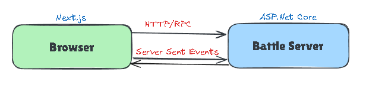

# Slaycard - Technical Documentation
Technical Documentation for Slaycard - a Turn-Based Combat Game

Project repository with the source code can be found [here](https://github.com/netspie/slaycard).

### Purpose

The project is primarily created for educational purposes.

### Description

Slaycard is turn-based combat game where you can manage your team of characters and battle against others. Each character can be developed in a unique way, which can influence the style of gameplay. You can choose from multiple opponents, gather experience from the concluded battles and improve your characters statistics and skills.

Each unit has four base statistics:
- Vitality
- Agility
- Power
- Mind
- .. and maybe Defence (optional, to be decided)

Each of the base statistics has an impact on your combat statistics which are used directly in the battle:
- Health (as % rather than fixed value)
- Energy (to be decided/improved)

- Damage - damage dealt to the opponents in combat, it is compared with enemy's defence
- Defence - improves techniques to effectively defend oneself from an attack thus lowering the taken damage
- Accuracy - in combat it is compared with opponent's dodge to calculate the % of probability to hit or miss
- Dodge - helps to avoid opponets attacks
- Speed - lets the character to perform action more often
- Critics - improves chances for critical damage in combat (1.5x, 2x, or 3x damage)

   
| Combat Stat | Influencing Base Stats |
| --- | --- |
| Damage | Power |
| Defence | Defence, Power |
| Accuracy | Mind, Power |
| Dodge | Agility, Mind |
| Speed | Agility |
| Critics | Mind |

### Game Versions

Based on initial system design the game development is divided into separate releases/versions, where each one adds additional features or qualities to the product. Initial versions are described later in the documentation.

## Current Version - 1.0.0 (in development)

### Features

- Combat
  - Select the team you want to perform battle with from predefined sets of units and battle against opponents
  - Attack opponents when it's your unit's turn
  - Heal characters if low health level

### Non-Functional Attributes

- The Simplest Gameplay Possible
- Minimal UI
- Web-Browser Only
- Mandatory Integration Tests Only
- Simple Deployment Pipeline

*Out of scope*
- Authentication
- Persistence Storage
- Real-time Communication
- Availability, Scalability and Monitoring
- Performance Optimizations

### Domain Logic Boundaries/Modules

- Combat - responsible for executing the ongoing combat
- Unit Details - details about every unit's level, xp and statistics
- Combat Teams Preview and Selection - own and opponent's

### System Level Architecture

### Frontend Architecture

### Backend Architecture

## Future Version - 1.1.0

### Non-Functional Improvements

- Real-time events communication between the client and server.

### Architecture

## Future Version - 1.2.0

### New Features

- Replay completed battles anytime you want and learn from the mistakes you made..

### Non-Functional Improvements

- Store events in the database allowing for later processing
  
### Architecture

## Future Version - 2.0.0

### New Features

- Character Progression - Gain experience from completed battles and increase you characters statistics

### Non-Functional Improvements

- ..

### Architecture

## Future Version - 2.1.0

### Non-Functional Improvements

- Add monitoring system to ensure correct performance and availability
  
### Architecture

