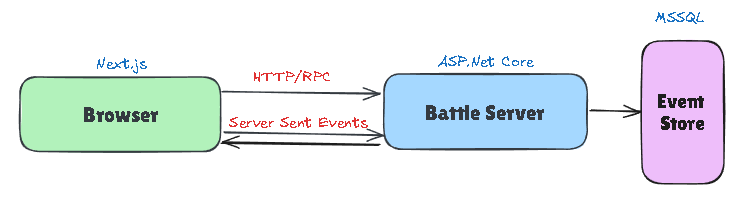

# Slaycard - Technical Documentation
Technical Documentation for Slaycard - a Turn-Based Combat Game

Project repository with the source code can be found [here](https://github.com/netspie/slaycard).

### Description

Slaycard is turn-based combat game where you can manage your team of characters and battle against others. Each character can be developed in a unique way, which can influence the style of gameplay. You can choose from multiple opponents, gather experience from the concluded battles and improve your characters statistics and skills.

Each unit contains for base statistics 
- Vitality
- Agility
- Power
- Mind

Each of the base statistics has an impact on your combat statistics which are used directly in the battle
- Health
- Damage
- Defence
- Accuracy
- Dodge
- Critics

### Game Versions

Based on initial system design the game development is divided into separate releases/versions, where each one adds additional features or qualities to the product. Initial versions are described later in the documentation.

## Current Version - 1.0.0 (in development)

### Features

- Combat
  - Select the team you want to perform battle with from predefined sets of units and battle against opponents
  - Attack opponents when it's your unit's turn
  - Heal characters if low health level

### Architecture

## Future Version - 1.1.0

### Non-Functional Improvements

- Real-time events communication between the client and server.

### Architecture

## Future Version - 1.2.0

### New Features

- Replay completed battles anytime you want and learn from the mistakes you made..

### Non-Functional Improvements

- Store events in the database allowing for later processing
  
### Architecture

## Future Version - 2.0.0

### New Features

- Character Progression - Gain experience from completed battles and increase you characters statistics

### Non-Functional Improvements

- ..

### Architecture

## Future Version - 2.1.0

### Non-Functional Improvements

- Add monitoring system to ensure correct performance and availability
  
### Architecture

